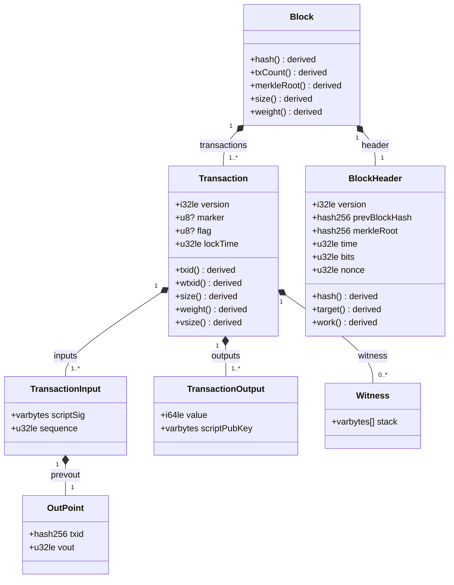

# Bitcoin Schema

**v0.0.14** · A canonical, machine-readable model of the Bitcoin protocol, written in JSON-LD.

One schema; many projections: byte-exact binary serialization, explorer views, RDF/linked data,
and (eventually) declarative validation rules in the spirit of
[Hornet Node](https://hornetnode.org/paper.html)'s formal consensus specification.

**Live:** https://bitcoin-desktop.github.io/schema/ ·
**Apps:** [light node](https://bitcoin-desktop.github.io/schema/apps/node.html) ·
[transaction decoder](https://bitcoin-desktop.github.io/schema/apps/tx.html) ·
[header chain verifier](https://bitcoin-desktop.github.io/schema/apps/headers.html) ·
[SPV proof verifier](https://bitcoin-desktop.github.io/schema/apps/spv.html) ·
[pruned block validator](https://bitcoin-desktop.github.io/schema/apps/blocks.html) ·
[block miner](https://bitcoin-desktop.github.io/schema/apps/mine.html) ·
[p2p wire decoder](https://bitcoin-desktop.github.io/schema/apps/p2p.html) ·
[watch-only wallet](https://bitcoin-desktop.github.io/schema/apps/wallet.html) ·
[compact filters](https://bitcoin-desktop.github.io/schema/apps/filters.html)

> Independent community project; not affiliated with Bitcoin Core.

## The idea

Bitcoin's consensus rules and data structures are defined, in practice, by implementation code.
This repo takes the opposite approach: a **declarative schema** is the source of truth, and
code is a projection of it.

Every field of every structure is tagged with its epistemic class:

- **Consensus fields** exist in the canonical byte stream and are covered by proof-of-work.
  They carry wire annotations (`wireType`, ordering, conditional presence) sufficient for a
  generic codec to serialize and deserialize them with no per-type code.
- **Derived fields** (`txid`, `wtxid`, block `hash`, `weight`, merkle root, target, work…)
  are computed deterministically from consensus bytes and are **never serialized**.
  Their derivation formulas are part of the schema.
- **Contextual fields** (height, confirmations, fee, spent status) depend on chain state and
  will live in the `chain` module — never mixed into consensus structures.

The keystone test: the schema-driven [reference codec](codec/codec.js) must round-trip real
mainnet data **byte-exactly**. The [test suite](test/) does this for the genesis block and the
first segwit transaction, and verifies every derivation (txid, wtxid, block hash, merkle root,
proof-of-work, size/weight/vsize) against known mainnet values. If the schema can't reproduce
consensus bytes, it's documentation; because it can, it's canonical.

## Data model

The core consensus structures, as a UML class diagram — **generated from
[`schema/core.jsonld`](schema/core.jsonld)** by [`tools/gen-class-diagram.js`](tools/gen-class-diagram.js),
so it can never drift from the schema. Filled diamonds are composition; `+name()` methods are
**derived** fields (computed from consensus bytes, never serialized).



## Everything is JSON-LD

- The **schema itself** ([schema/core.jsonld](schema/core.jsonld)) is a JSON-LD graph —
  classes and properties get dereferenceable URIs under
  `https://bitcoin-desktop.github.io/schema/`.
- **Instances** (a decoded transaction, a block) are JSON-LD documents using
  [context.jsonld](context.jsonld).
- Hashes are hex strings in display order (byte-reversed, as in every explorer and RPC);
  amounts are satoshis as plain JSON numbers (max supply is well inside the float53 safe range).
- The only non-JSON projection is the consensus byte stream itself.

## Modules and layering

Strict one-way dependencies (Hornet-style): a module may only reference modules above it.

| module | status | contents |
|---|---|---|
| `core` | **shipped** | Block, BlockHeader, Transaction, TransactionInput, TransactionOutput, OutPoint, Witness — full wire annotations + derivations |
| `chain` | **shipped** | NetworkParams for all five networks (mainnet, testnet, **testnet4** with BIP 94 timewarp/min-difficulty semantics, signet, regtest), Coin (UTXO entry), and Checkpoint sync anchors. Planned: mempool, BIP 9 deployments |
| `validate` | **partial** | five phase rulesets, **31 rules** as data, at full parity with Hornet Node's declarative rule specification (header version requirements, sigop limits, tx finality, coinbase maturity included). Bitcoin Core error codes, activation gating. Planned: script execution |
| `proof` | **shipped** | MerkleBlock / partial merkle tree (BIP 37); compact filters (BIP 158: SipHash-2-4 + Golomb-Rice sets, byte-identical to the official vectors) with the BIP 157 filter-header chain and p2p payload structs |
| `script` | **partial** | full Opcode enumeration, ScriptType templates as data with address-encoding rules, SighashType, ScriptLimits — plus a working [interpreter](codec/interpreter.js): per-opcode handlers, legacy + BIP 143 + BIP 341 sighash, pure-BigInt ECDSA and Schnorr, every spend path: p2pk/p2pkh/multisig/p2sh (incl. wrapped segwit)/p2wpkh/p2wsh/**p2tr key & script path** with tapscript (CHECKSIGADD, OP_SUCCESSx). Planned: descriptors |
| `p2p` | **shipped** | the 24-byte envelope, 13 payload structs, and a 34-command enumeration mapping every command to its struct — `tx`/`block`/`merkleblock` carry the core/proof structs unchanged. The golden vector is a real mainnet handshake our engine performed over TCP, replayed byte-exactly in CI |
| `mine` | **shipped** | BlockTemplate (getblocktemplate-shaped), coinbase construction (BIP 34 push, witness commitment, extraNonce), nonce grinding — plus testnet/signet/regtest NetworkParams instances and address *decoding* (base58check, bech32/bech32m) |
| `wallet` | **shipped** | watch-only by design: BIP 32 xpub parsing + public derivation (SHA-512/HMAC from generated constants), BIP 86 taproot addresses, BIP 174 PSBT (byte-exact round-trips, finalized-tx extraction **with interpreter signature verification**), BIP 21 URIs. Planned: descriptors |

The [header engine](codec/headers.js) executes the `validate` ruleset directly from the schema:
rule order, identity, and error codes are data; the engine binds pure check implementations to
rule IDs (Hornet-style). The rulesets cover every rule in Hornet's
header/transaction/block-structural/block-contextual specification, and as of v0.0.7 the
`scripts` rule executes unlocking scripts and verifies real ECDSA signatures (legacy and
BIP 143) — the test suite verifies every signature in blocks 100000-100005 from raw bytes.
As of v0.0.8 taproot verifies too (Schnorr/BIP 340, key and script paths/BIP 341,
tapscript/BIP 342, validated against the official BIP vectors and live mainnet spends) —
no spend path is unsupported; the scripts rule skips only for genuinely pruned-away data.
Difficulty retargeting is tested against the first retarget in history
(block 32256, 2009-12-30) and a current one, reproduced bit-for-bit; chain work matches Core's
arithmetic (genesis = `0x100010001`).

## Roadmap

Each milestone is a working artifact, not just more schema:

1. **Headers** ✅ (v0.0.2) — headers-only chain sync and verification (PoW, difficulty
   retargeting, median-time-past, chain work) in the browser:
   [apps/headers.html](https://bitcoin-desktop.github.io/schema/apps/headers.html).
2. **SPV** ✅ (v0.0.3) — verify transaction inclusion with raw BIP 37 merkle proofs,
   decoded and checked in the browser: [apps/spv.html](https://bitcoin-desktop.github.io/schema/apps/spv.html).
   Compact filters shipped in v0.0.12.
3. **Pruned node** ✅ (v0.0.5) — full structural + contextual validation over a hard-capped
   window of **at most 6 blocks**, evolving a UTXO set, satoshi-exact fees and coinbase checks,
   activation-gated rules (BIP 34, witness commitment), in the browser:
   [apps/blocks.html](https://bitcoin-desktop.github.io/schema/apps/blocks.html).
   Rules whose context was pruned away are *skipped and say so*. Script/signature execution
   is the stated remaining gap.
4. **Mining** ✅ (v0.0.9) — assemble and mine real blocks, then judge them with the same
   schema's validator (independent codepaths, one source of truth):
   [apps/mine.html](https://bitcoin-desktop.github.io/schema/apps/mine.html) mines a regtest
   chain in the browser and self-validates every rule, including BIP 34 heights and witness
   commitments. The negative tests are the fun ones: a premature coinbase spend and a
   toy-difficulty mainnet continuation are both rejected by our own rules.
5. **P2P** ✅ (v0.0.10) — the wire message layer: the test vector is a live handshake with a
   Bitcoin Core 31.0 node, performed by the schema-driven engine itself (we sent version and
   verack; their version/wtxidrelay/sendaddrv2/verack/sendcmpct/ping/feefilter replay
   byte-exactly). [apps/p2p.html](https://bitcoin-desktop.github.io/schema/apps/p2p.html)
   decodes any raw stream. A live socket loop (relay, mempool) is a host-environment concern —
   browsers cannot open TCP — and remains future work, as do the BIP 152/155 payload structs (the BIP 157 ones shipped with compact filters in v0.0.12).
6. **Wallet** ✅ (v0.0.11) — watch-only: derive addresses from any xpub (verified against the
   official BIP 32 chains and BIP 86 taproot vectors), decode any PSBT (all 24 official BIP 174
   vectors round-trip byte-exactly), and — the part nothing else does in 0 dependencies — extract
   a finalized PSBT and *verify its signatures* with the schema's own interpreter:
   [apps/wallet.html](https://bitcoin-desktop.github.io/schema/apps/wallet.html).
7. **Light node** ✅ (v0.0.13) — the chassis for browser/desktop/mobile mesh nodes
   ("the WebTorrent of Bitcoin"): a persistent LightNode that syncs headers forward from a
   schema-defined checkpoint into IndexedDB, validates every header through the 7-rule header
   phase (testnet4's BIP 94 retarget and min-difficulty walk-back included, reproduced
   bit-for-bit from the live chain), cross-checks sources with divergence detection, and
   verifies transactions against its own chain:
   [apps/node.html](https://bitcoin-desktop.github.io/schema/apps/node.html).
8. **The bridge** ✅ (v0.0.14) — the webtorrent-hybrid: `npm run bridge` starts a
   zero-dependency daemon (even the WebSocket server is ours, built on our own SHA-1) that
   handshakes with a real peer over TCP and relays schema wire messages to browser LightNodes
   over WebSocket — genuine IBD at 2,000 headers per message (live test: a real testnet4 peer,
   checkpoint to tip, ~1,800 headers validated in under a second). Point the
   [light node app](https://bitcoin-desktop.github.io/schema/apps/node.html) at
   `ws://localhost:8334`. Next: the WebRTC mesh (Nostr signaling).
9. **NostrSource** ✅ (v0.0.17) — the LightNode drinks from the
   [NIP-333](https://nip-333.github.io/) live stream: kind-33333 events (12 headers, one
   replaceable stream per network) become a header source ([codec/nostr.js](codec/nostr.js)) —
   read-only, event id + BIP-340 verified with our own verifier, never signing. Serves tip
   following (`headersAfter`) and the divergence cross-check within its 12-header window;
   the publisher stays untrusted because every header passes the same validation rules as
   any other source. Golden vector: a real production event captured from a relay.

## Using the codec

```js
import { Codec } from './codec/codec.js';

const core = await (await fetch('schema/core.jsonld')).json();
const codec = new Codec(core);

const tx = codec.decode('Transaction', rawHex); // JSON-LD-ready object
codec.txid(tx);                                  // derived: display-order txid
codec.encodeHex('Transaction', tx) === rawHex;   // byte-exact, always
```

Zero dependencies, browser and Node. Run the golden tests with `npm test`.

## Relationship to other work

- **[Hornet Node](https://hornetnode.org/)** specifies Bitcoin's *rules* as declarative,
  pure-function rulesets; this schema specifies the *structures, wire format, and derivations*
  those rules operate over. The planned `validate` module mirrors Hornet's four validation
  phases (header, transaction, block-structural, block-contextual) so rule IDs can be shared
  across implementations for differential testing.
- **[schema.org](https://schema.org/)** is the stylistic model: a pragmatic, web-native
  vocabulary where every term has a URI and a readable page.
- **ASN.1 / Kaitai Struct** are the precedents for byte-level encoding annotations; unlike
  them, this schema also carries semantics (derivations, BIP provenance, RDF projection).

## License

MIT
